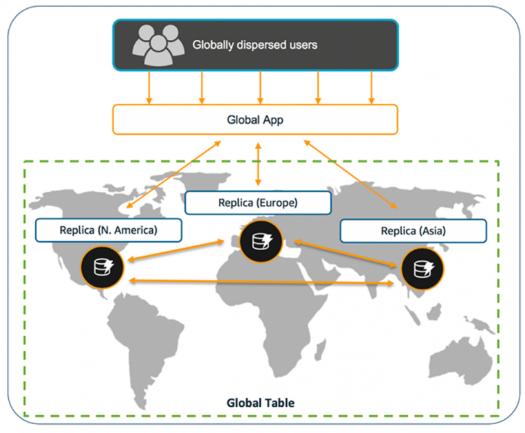
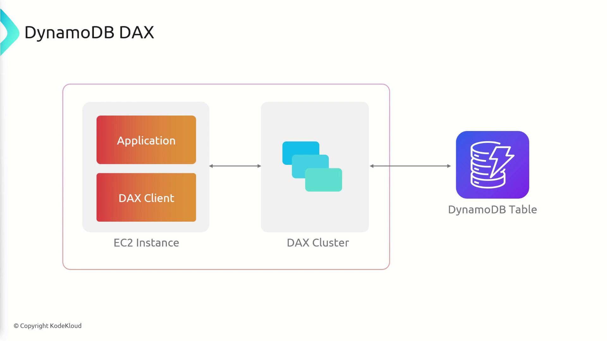
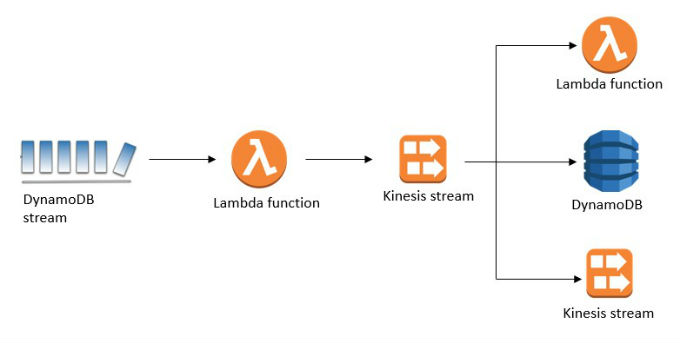

# Amazon DynamoDB

## 1. Overview

**Amazon DynamoDB** is a fully managed, serverless NoSQL database service provided by AWS.

Unlike relational databases such as MySQL or PostgreSQL, NoSQL databases do not primarily organize data using relational tables and joins.

Common NoSQL data models include:

### Key-Value

Data is stored as a key and value pair.

```text
Key             Value

user-101   →    User Data
product-01 →    Product Data
session-10 →    Session Data
```

Example:

```json
{
  "userId": "user-101",
  "name": "John"
}
```

---
### Document

Data is stored as structured documents.

Common formats:

- JSON
- BSON
- XML

Example:

```json
{
  "userId": "101",
  "name": "John",
  "address": {
    "city": "Ho Chi Minh City",
    "country": "Vietnam"
  }
}
```

---
### Column-Oriented

Data is organized around columns or column families.

Common use cases:

- Big Data
- Analytics
- Large-scale distributed systems

---
### Graph Database

Data is represented using:

```text
Node
 │
 ▼
Relationship
 │
 ▼
Node
```

Example:

```text
User A ── FRIEND ── User B
```

Graph databases are suitable for:

- Social networks
- Recommendation systems
- Relationship analysis

---
## 2. Amazon DynamoDB

DynamoDB is a:

- Fully managed database
- Serverless database
- Distributed NoSQL database
- Key-value and document database

Data is organized into **Tables**.

Basic architecture:

```text
Application
     │
     ▼
DynamoDB API
     │
     ▼
DynamoDB Table
     │
     ├── Item
     ├── Item
     └── Item
```

DynamoDB provides:

- Single-digit millisecond performance
- Automatic scaling
- High Availability
- Flexible data schema
- Encryption
- Backup and restore
- Multi-Region replication with Global Tables

DynamoDB is suitable for applications where the data structure can change frequently.

Example:

```json
{
  "userId": "101",
  "name": "John"
}
```

Another item in the same table can contain additional attributes:

```json
{
  "userId": "102",
  "name": "Anna",
  "email": "anna@example.com",
  "phone": "0123456789"
}
```

The non-key attributes do not need to be identical between items.

---
## 3. When and Where is DynamoDB Used?

DynamoDB is suitable for applications that require:

- High scalability
- Low latency
- High request throughput
- Flexible schema
- Serverless architecture
- Large numbers of concurrent users

Typical architecture:

```text
Client
   │
   ▼
API Gateway
   │
   ▼
AWS Lambda
   │
   ▼
DynamoDB
```

This architecture is commonly used for serverless applications.

---
## 4. DynamoDB Use Cases

### Gaming Platforms

Store:

- Player profiles
- Game sessions
- Player scores
- Leaderboards
- Game state

Example:

```text
PlayerID
   │
   ├── Level
   ├── Score
   └── Game State
```

---
### Logistics Systems

Store:

- Shipment status
- Tracking information
- Delivery events
- Package locations

Example:

```text
TrackingID
     │
     ├── Current Location
     ├── Delivery Status
     └── Update Time
```

---
### IoT Applications

IoT devices can continuously send data to AWS.

```text
IoT Devices
     │
     ▼
AWS IoT
     │
     ▼
DynamoDB
```

Store:

- Device ID
- Device status
- Sensor data
- Device metadata

---
### User Session Management

DynamoDB can store application session data.

```text
SessionID
    │
    ├── UserID
    ├── Token
    └── Expiration Time
```

---
### E-Commerce

DynamoDB can be used for:

- Shopping carts
- Product metadata
- User sessions
- Product catalogs

Example:

```text
User
 │
 ▼
Shopping Cart
 │
 ├── Product A
 ├── Product B
 └── Product C
```

---
### Serverless Applications

Typical architecture:

```text
API Gateway
     │
     ▼
Lambda
     │
     ▼
DynamoDB
```

DynamoDB works well with Lambda because both services can automatically scale based on workload.

---
## 5. DynamoDB Capacity

DynamoDB supports two main capacity modes:

```text
DynamoDB Capacity Mode
        │
        ├── On-Demand
        │
        └── Provisioned
```

### On-Demand Mode

AWS automatically manages read and write capacity.

Suitable for:

- Unpredictable traffic
- New applications
- Variable workloads

Concept:

```text
Traffic Increase
      │
      ▼
DynamoDB handles capacity
```

---
### Provisioned Mode

The administrator configures:

- Read Capacity Units
- Write Capacity Units

```text
Provisioned Capacity

RCU = Read Capacity
WCU = Write Capacity
```

Auto Scaling can be configured to adjust provisioned capacity.

---
## 6. Read Capacity Unit - RCU

**RCU (Read Capacity Unit)** represents read capacity in DynamoDB Provisioned Mode.

For an item up to **4 KB**:

```text
1 RCU
 │
 ├── 1 Strongly Consistent Read / second
 │
 └── 2 Eventually Consistent Reads / second
```

A transactional read requires:

```text
2 RCU
   │
   ▼
1 Transactional Read / second
```

for an item up to 4 KB.

### Example

Item size:

```text
3 KB
```

Strongly consistent read:

```text
1 RCU
```

Item size:

```text
6 KB
```

DynamoDB rounds the size to the next 4 KB block.

```text
6 KB
 ↓
8 KB

8 KB / 4 KB = 2 RCU
```

For a strongly consistent read:

```text
2 RCU
```

---
## 7. Read Consistency

DynamoDB supports different read consistency models.

### Eventually Consistent Read

This is the default read consistency model.

After a write operation:

```text
Write Data
    │
    ▼
Read Immediately
    │
    ▼
May return older data
```

After a short period:

```text
Read Again
    │
    ▼
Latest Data
```

Advantages:

- Lower capacity consumption
- Suitable for workloads that can tolerate temporary stale data

Use cases:

- Product catalog
- Social feed
- Game statistics

---
### Strongly Consistent Read

A strongly consistent read returns the latest successfully written data.

```text
Write Data
    │
    ▼
Strong Read
    │
    ▼
Latest Data
```

Use cases:

- Account state
- Critical application state
- Workloads requiring the latest data

Strongly consistent reads are supported on:

- DynamoDB Tables
- Local Secondary Indexes

They are not supported on Global Secondary Indexes.

---
## 8. Write Capacity Unit - WCU

**WCU (Write Capacity Unit)** represents write capacity in DynamoDB Provisioned Mode.

For an item up to **1 KB**:

```text
1 WCU
   │
   ▼
1 Standard Write / second
```

Transactional write:

```text
2 WCU
   │
   ▼
1 Transactional Write / second
```

### Example

Item size:

```text
500 Bytes
```

Required capacity:

```text
1 WCU
```

Item size:

```text
1.5 KB
```

DynamoDB rounds the item size to the next 1 KB block.

```text
1.5 KB
   ↓
2 KB
```

Required capacity:

```text
2 WCU
```

---
## 9. DynamoDB Core Concepts

```text
Table
 │
 ├── Item
 │    ├── Attribute
 │    ├── Attribute
 │    └── Attribute
 │
 └── Item
      ├── Attribute
      └── Attribute
```

### Table

A Table is the highest-level data structure in DynamoDB.

Example:

```text
Users Table
Products Table
Orders Table
```

Table names must be unique within an AWS account and Region.

---
### Item

An Item represents a single data record.

Similar concept:

```text
SQL Row ≈ DynamoDB Item
```

Example:

```json
{
  "UserID": "U001",
  "Name": "John",
  "Age": 22
}
```

---
### Attribute

An Attribute represents a data field.

Similar concept:

```text
SQL Column ≈ DynamoDB Attribute
```

Example:

```text
UserID
Name
Age
Email
```

---
## 10. Primary Key

A Primary Key uniquely identifies each item in a DynamoDB table.

There are two types of Primary Keys.

### Simple Primary Key

Contains only a **Partition Key**.

```text
Primary Key
     │
     ▼
Partition Key
```

Example:

```text
UserID
```

Table:

```text
UserID      Name

U001        John
U002        Anna
U003        Peter
```

Each Partition Key value must be unique.

---
### Composite Primary Key

Contains:

```text
Partition Key
      +
Sort Key
```

Example:

```text
UserID + OrderID
```

Table:

```text
UserID      OrderID

U001        ORD001
U001        ORD002
U001        ORD003
U002        ORD001
```

The combination must be unique:

```text
Partition Key + Sort Key
```

Architecture:

```text
Partition Key
      │
      ▼
    U001
      │
      ├── ORD001
      ├── ORD002
      └── ORD003
           ▲
           │
        Sort Key
```

The Partition Key determines how DynamoDB distributes data.

The Sort Key organizes related items within the same Partition Key.

---
## 11. Query vs Scan

### Query

`Query` retrieves items using a Partition Key value.

Example:

```text
Get all orders for User U001
```

```text
Partition Key = U001
        │
        ▼
      Query
        │
        ├── ORD001
        ├── ORD002
        └── ORD003
```

Characteristics:

- Requires a Partition Key value
- Can use Sort Key conditions
- Efficient
- Reads a specific item collection

Example condition:

```text
UserID = U001
AND
OrderDate > 2026-01-01
```

---
### Scan

`Scan` reads every item in a table or index.

```text
Table
 │
 ├── Item 1
 ├── Item 2
 ├── Item 3
 ├── Item 4
 └── Item 5
      │
      ▼
     Scan
```

After reading the data, DynamoDB can apply a filter.

Example:

```text
Scan entire table
       │
       ▼
Filter Age > 20
```

### Query vs Scan

| Feature | Query | Scan |
|---|---|---|
| Partition Key | Required | Not required |
| Data Access | Specific partition | Entire table/index |
| Performance | More efficient | Less efficient |
| Capacity Usage | Usually lower | Can be high |
| Common Use | Known access pattern | Search all data |

### Important

Prefer:

```text
Query
```

Instead of:

```text
Scan
```

when the access pattern is known.

A Scan can consume significant read capacity on large tables.

---
## 12. Secondary Indexes

Secondary indexes allow DynamoDB to support additional query patterns.

Without an index:

```text
Primary Key

UserID
```

The application can efficiently query using:

```text
UserID
```

But what if the application needs:

```text
Find user by Email
```

A Secondary Index can provide another access pattern.

```text
Email
  │
  ▼
Secondary Index
```

DynamoDB supports:

```text
Secondary Index
      │
      ├── Global Secondary Index
      │
      └── Local Secondary Index
```

---
## 13. Global Secondary Index - GSI

A **Global Secondary Index (GSI)** can use a different Partition Key and Sort Key from the base table.

Example base table:

```text
Primary Key

UserID
```

Application requirement:

```text
Find users by Email
```

Create GSI:

```text
GSI Partition Key

Email
```

Architecture:

```text
Base Table
UserID
   │
   ▼
Users Data

GSI
Email
   │
   ▼
Users Data
```

GSI allows queries using an alternative key schema.

Important characteristics:

- Can use a different Partition Key
- Can use a different Sort Key
- Spans the entire table
- Can be created after the table is created
- Supports eventually consistent reads

Example:

```text
Base Table

PK = UserID
SK = OrderID
```

GSI:

```text
PK = ProductID
SK = OrderDate
```

Now the application can query:

```text
Orders by User
```

and:

```text
Orders by Product
```

---
## 14. Local Secondary Index - LSI

A **Local Secondary Index (LSI)** uses the same Partition Key as the base table but uses a different Sort Key.

Example base table:

```text
Partition Key = UserID
Sort Key      = OrderID
```

LSI:

```text
Partition Key = UserID
Sort Key      = OrderDate
```

Architecture:

```text
Base Table

UserID + OrderID
```

```text
LSI

UserID + OrderDate
```

Important characteristics:

- Same Partition Key as the base table
- Different Sort Key
- Must be created when the table is created
- Supports strongly consistent reads

---
## 15. GSI vs LSI

| Feature | GSI | LSI |
|---|---|---|
| Partition Key | Can be different | Must be the same |
| Sort Key | Can be different | Must be different |
| Scope | Entire table | Same Partition Key |
| Create After Table | Yes | No |
| Strong Consistent Read | No | Yes |
| Common Usage | New access pattern | Alternative sorting |

Easy way to remember:

```text
GSI
│
└── Global → Different access pattern
```

```text
LSI
│
└── Local → Same Partition Key
```

---
## 16. DynamoDB Data Types

DynamoDB supports several data types.

### Scalar Types

```text
String
Number
Binary
Boolean
Null
```

### Document Types

```text
List
Map
```

Example:

```json
{
  "UserID": "U001",
  "Name": "John",
  "Active": true,
  "Address": {
    "City": "Ho Chi Minh City",
    "Country": "Vietnam"
  }
}
```
### Set Types

```text
String Set
Number Set
Binary Set
```

---
## 17. PartiQL

**PartiQL** is a SQL-compatible query language supported by DynamoDB.

Example:

```sql
SELECT *
FROM Users
WHERE UserID = 'U001'
```

Insert data:

```sql
INSERT INTO Users
VALUE {
    'UserID': 'U001',
    'Name': 'John'
}
```

PartiQL helps developers familiar with SQL interact with DynamoDB using SQL-like syntax.

### Important

PartiQL does not turn DynamoDB into a relational database.

```text
PartiQL
   │
   ▼
SQL-compatible syntax
   │
   ▼
DynamoDB operations
```

The underlying database is still NoSQL.

---
## 18. DynamoDB Global Tables



**DynamoDB Global Tables** provide multi-Region replication.

Architecture:

```text
             Application
                  │
        ┌─────────┴─────────┐
        ▼                   ▼
   Asia Region         US Region
        │                   │
        ▼                   ▼
 DynamoDB Table  ◄────► DynamoDB Table
        │                   │
        └──── Replication ──┘
```

Global Tables use a multi-Region architecture.

Replica tables exist in multiple AWS Regions.

Example:

```text
ap-southeast-1
       │
       ▼
DynamoDB Replica

us-east-1
       │
       ▼
DynamoDB Replica
```

Global Tables are useful for:

- Global applications
- Multi-Region architectures
- Disaster Recovery
- Low-latency regional access
- High Availability

Global Tables provide a **99.999% availability SLA**.

Concept:

```text
Asia User
    │
    ▼
Asia Region

US User
    │
    ▼
US Region
```

Users can access a DynamoDB replica closer to their Region.

---

## 19. DynamoDB Accelerator - DAX



**DynamoDB Accelerator (DAX)** is a fully managed in-memory cache designed for DynamoDB.

Architecture:

```text
Application
     │
     ▼
DAX Client
     │
     ▼
DAX Cluster
     │
     ▼
DynamoDB
```

Without DAX:

```text
Application
     │
     ▼
DynamoDB
```

With DAX:

```text
Application
     │
     ▼
DAX
 │       │
 │ HIT   │ MISS
 ▼       ▼
Cache   DynamoDB
```

### Cache Hit

Requested data exists in DAX.

```text
Application
     │
     ▼
DAX Cache
     │
     ▼
Return Data
```

DynamoDB does not need to be queried.

---
### Cache Miss

Requested data does not exist in DAX.

```text
Application
     │
     ▼
DAX
     │
     ▼
DynamoDB
     │
     ▼
Return Data
     │
     ▼
Store in DAX
```

DAX can reduce read latency from milliseconds to microseconds for cached data.

DAX is suitable for:

- Read-heavy applications
- Gaming platforms
- Product catalogs
- High-traffic applications

### Important

Applications require a **DAX Client** to communicate with the DAX cluster.

```text
AWS SDK DynamoDB Client
        ↓
     DAX Client
```

DAX is primarily used to accelerate read workloads.

---
## 20. DynamoDB Export to S3

DynamoDB supports exporting table data to Amazon S3.

Architecture:

```text
DynamoDB
    │
    ▼
Export
    │
    ▼
Amazon S3
```

Exported data can be used for:

- Data analytics
- Data archiving
- Data lake
- Machine Learning
- Big Data processing

Example architecture:

```text
DynamoDB
    │
    ▼
Amazon S3
    │
    ├── Athena
    ├── Glue
    ├── EMR
    └── Analytics
```

---

## 21. DynamoDB Streams



**DynamoDB Streams** captures item-level changes in a DynamoDB table.

Changes include:

```text
INSERT
MODIFY
REMOVE
```

Architecture:

```text
DynamoDB Table
      │
      ▼
DynamoDB Stream
      │
      ▼
AWS Lambda
      │
      ▼
Process Event
```

Example:

```text
New Order Created
       │
       ▼
DynamoDB
       │
       ▼
DynamoDB Stream
       │
       ▼
Lambda
       │
       ▼
Send Notification
```

Common use cases:

- Event-driven applications
- Data synchronization
- Audit processing
- Notifications
- Triggering Lambda functions

Example:

```text
Order Table
    │
    ▼
New Order
    │
    ▼
DynamoDB Stream
    │
    ▼
Lambda
    │
    ├── Send Email
    ├── Update Inventory
    └── Create Notification
```

---
## 22. DynamoDB vs RDS

| Feature | DynamoDB | RDS |
|---|---|---|
| Database Type | NoSQL | Relational |
| Schema | Flexible | Structured |
| SQL | No native relational SQL model | SQL |
| JOIN | No | Yes |
| Scaling | Built for horizontal scale | Instance/cluster based |
| Serverless | Yes | Depends on service/configuration |
| Latency | Single-digit milliseconds | Depends on DB and workload |
| Relationships | Application design | Relational model |
| Common Use | High-scale key access | Relational data |

Use DynamoDB when:

```text
Known Access Patterns
High Scale
Low Latency
Flexible Schema
Serverless Application
```

Use RDS when:

```text
Complex Relationships
SQL Queries
JOIN
Relational Data
Traditional Transactions
```

---

## Key Takeaways

- DynamoDB is a fully managed, serverless NoSQL database.
- DynamoDB supports key-value and document data models.
- Data is organized using Tables, Items, and Attributes.
- A Primary Key can be a Simple Primary Key or Composite Primary Key.
- The Partition Key determines data distribution.
- The Sort Key organizes related items within the same Partition Key.
- Query is more efficient than Scan for known access patterns.
- GSI provides an alternative key schema across the entire table.
- LSI uses the same Partition Key with a different Sort Key.
- 1 RCU supports one strongly consistent read or two eventually consistent reads per second for an item up to 4 KB.
- 1 WCU supports one standard write per second for an item up to 1 KB.
- Transactional reads and writes consume twice the capacity units.
- Global Tables provide multi-Region replication and a 99.999% availability SLA.
- DAX provides in-memory caching for DynamoDB.
- DynamoDB Streams capture item-level changes.
- DynamoDB data can be exported to Amazon S3.