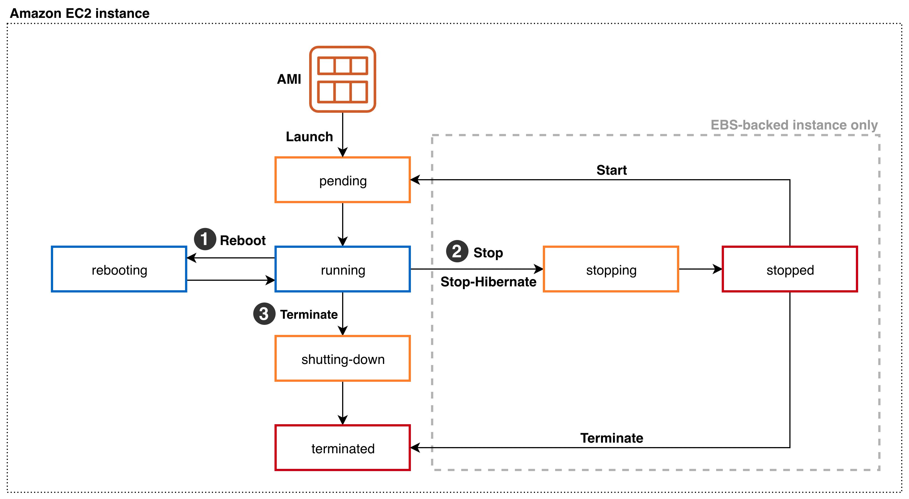

# Amazon EC2 (Elastic Compute Cloud)

## What is EC2?

Amazon EC2 (Elastic Compute Cloud) is a virtual server service that allows users to launch and manage virtual machines in the AWS Cloud.

EC2 provides scalable computing resources without purchasing physical hardware.

---

# When should I use EC2?

EC2 is suitable when applications require full control over the operating system and server configuration.

Common scenarios include:

- Lift & Shift migration from on-premises
- Hosting websites or web applications
- Running databases
- Kubernetes worker nodes
- Compute-intensive workloads
- Development and testing environments

---

# Common Use Cases

- Host a traditional web application
- Run backend APIs
- Deploy Docker containers
- Kubernetes Cluster (Worker Nodes)
- Database server
- Batch processing
- CI/CD runners

---

# Amazon Machine Image (AMI)

An **Amazon Machine Image (AMI)** is a pre-configured template used to launch an EC2 instance.

It contains:

- Operating System
- Installed software
- Configuration
- Application dependencies

Every EC2 instance **must** be launched from an AMI.

Think of an AMI as a **system image (Ghost/ISO)** that can be reused to create multiple identical servers.

### Custom AMI

Users can create their own AMIs after installing applications and configuring the server.

Benefits:

- Faster deployment
- Consistent environments
- Easy backup and recovery

---

# EC2 Instance Lifecycle

The lifecycle of an EC2 instance includes several states.

> **Image**





Typical states:

```
Pending
    ↓
Running
    ↓
Stopping
    ↓
Stopped
    ↓
Starting
    ↓
Running

Terminate
```

Notes:

- **Stop**: Instance is powered off but EBS data remains.
- **Start**: Instance boots again using the existing EBS volume.
- **Terminate**: Instance is permanently deleted.

---
# EC2 with Instance Store

Some EC2 instance types provide **Instance Store**, which is physically attached storage on the host machine.

Characteristics:

- Very high performance
- Temporary storage
- Data is lost when the instance stops or terminates
- Suitable for cache or temporary files

Do **not** store important data on Instance Store.

---
# User Data

**User Data** is a startup script that automatically runs when an EC2 instance launches for the first time.

It is commonly used to:

- Install packages
- Update the operating system
- Install Docker
- Deploy applications
- Configure web servers

Example:

```bash
#!/bin/bash
apt update
apt install nginx -y
systemctl enable nginx
systemctl start nginx
```

This allows infrastructure to be initialized automatically without manual configuration.

---
# Amazon EBS (Elastic Block Store)

Amazon EBS is a persistent block storage service for EC2 instances.

An EBS volume behaves like a virtual hard disk.

Characteristics:

- Must be attached to an EC2 instance
- Data persists after stopping the instance
- Can increase volume size while the instance is running
- Cannot decrease volume size

---
## EBS Volume Types

### General Purpose SSD

- gp2
- gp3

Suitable for:

- Web servers
- Application servers
- Development
- General workloads

---
### Provisioned IOPS SSD

- io1
- io2

Suitable for:

- High-performance databases
- Financial applications
- Low-latency workloads

---
### Throughput Optimized HDD

Suitable for:

- Big Data
- Data Warehouse
- Log Processing
- Streaming workloads

---
### Cold HDD

Suitable for:

- Backup
- Archive
- Infrequently accessed data

Lower cost but lower performance.

---
# Security Group

A Security Group acts as a virtual firewall for EC2 instances.

Characteristics:

- Stateful firewall
- Supports **Allow** rules only
- No **Deny** rules
- Default outbound allows all traffic
- One EC2 instance can attach multiple Security Groups

Typical rules:

Inbound

- HTTP (80)
- HTTPS (443)
- SSH (22)
- RDP (3389)

Outbound

- Allow All (default)

---
# Remote Desktop (Windows EC2)

To access a Windows EC2 instance:

1. Download the RDP file.
2. Use the private key (`.pem`) to decrypt the Administrator password.
3. Connect using Remote Desktop.

---
# Best Practices

- Use Security Groups instead of exposing unnecessary ports.
- Store application data on EBS instead of Instance Store.
- Create Custom AMIs for reusable environments.
- Use User Data to automate instance initialization.
- Stop unused EC2 instances to reduce costs.

---
# Common Mistakes

- Confusing **Stop** and **Terminate**.
- Storing important data on Instance Store.
- Opening SSH (22) to `0.0.0.0/0`.
- Forgetting to resize the filesystem after increasing an EBS volume.
- Hardcoding application configuration instead of using User Data.

---
# Related Services

- Amazon EBS
- Amazon VPC
- Security Group
- Elastic IP
- IAM
- Auto Scaling Group
- Elastic Load Balancer (ELB)
- Amazon CloudWatch

---