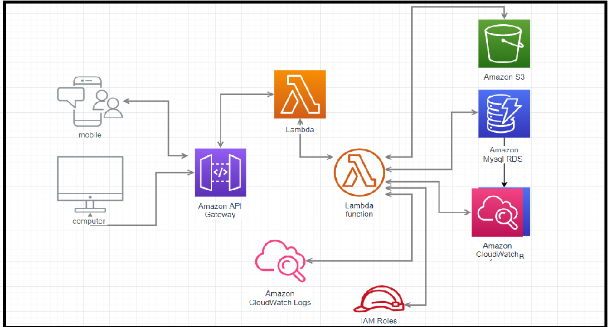
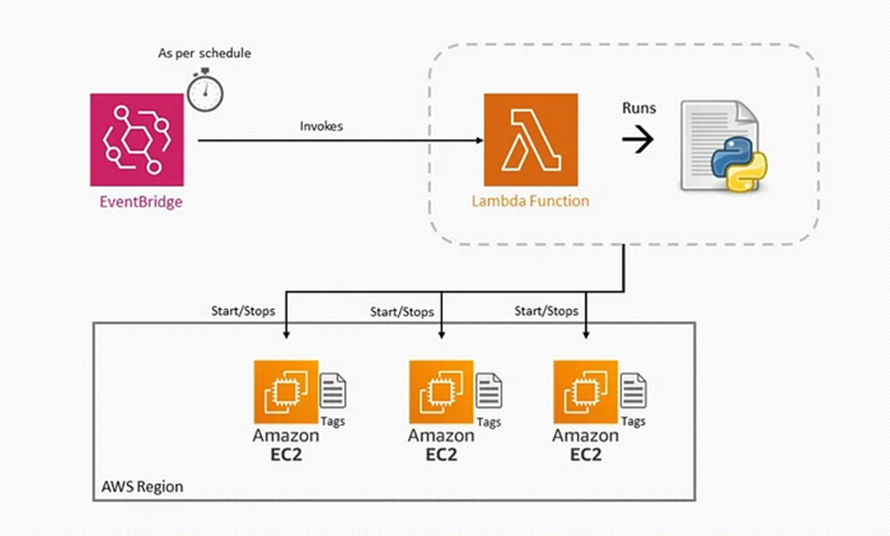

# AWS Lambda - Serverless Computing

## 1. Overview

**AWS Lambda** is a serverless compute service that allows applications to run code without provisioning or managing servers.

The developer provides the code:

```text
Write Code
    │
    ▼
Deploy Lambda Function
    │
    ▼
Event Trigger
    │
    ▼
Lambda Executes Code
    │
    ▼
Execution Finishes
```

AWS manages the underlying infrastructure, including:

- Server provisioning
- Infrastructure scaling
- High Availability
- Execution environments

Lambda functions run when they are invoked by an event or request.

Common Lambda runtimes include:

- Node.js
- Python
- Java
- .NET
- Ruby

Lambda also supports custom runtimes and container image deployment.

---
## 2. When and Where is Lambda Used?

Lambda is suitable for **event-driven and short-running workloads**.

Common scenarios:

- Infrastructure automation
- Serverless backend APIs
- File processing
- Event processing
- IoT workloads
- Data transformation
- ETL pipelines
- Scheduled tasks

Typical serverless architecture:

```text
Client
   │
   ▼
API Gateway
   │
   ▼
Lambda
   │
   ▼
DynamoDB
```

Lambda works especially well when the application reacts to an event.

```text
Event
  │
  ▼
Lambda Function
  │
  ▼
Process Task
```

---
## 3. Lambda Function Configuration

When creating a Lambda function, several important settings can be configured.

### Memory

Lambda memory can be configured from:

```text
128 MB
   │
   ▼
10,240 MB
```

Increasing memory also increases the CPU resources available to the function.

Conceptually:

```text
More Memory
     │
     ▼
More CPU Resources
```

Therefore, memory configuration affects:

- Performance
- Execution time
- Cost

---
### Ephemeral Storage

Lambda provides temporary storage using:

```text
/tmp
```

The configurable storage size is:

```text
512 MB
   │
   ▼
10,240 MB
```

Example:

```text
Lambda Function
      │
      ▼
Download File
      │
      ▼
/tmp
      │
      ▼
Process File
```

Ephemeral storage is useful for:

- Temporary files
- Image processing
- Data transformation
- Temporary downloads

### Important

`/tmp` is temporary execution environment storage.

Do not use it as permanent application storage.

For persistent storage, use services such as:

```text
Amazon S3
Amazon EFS
Database
```

---
### Timeout

The maximum Lambda execution timeout is:

```text
15 Minutes
```

or:

```text
900 Seconds
```

Example:

```text
Lambda Execution
       │
       ▼
Timeout Reached
       │
       ▼
Execution Stopped
```

Lambda is designed primarily for short-running tasks.

---
## 4. Event-Driven Architecture

Lambda can be triggered by many AWS services.

Example:

```text
API Gateway ─────┐
S3 ──────────────┤
EventBridge ─────┤
DynamoDB Streams ├──► Lambda
SQS ─────────────┤
SNS ─────────────┤
Kinesis ─────────┘
```

The trigger sends an event to the Lambda function.

```text
Event Source
     │
     ▼
Event
     │
     ▼
Lambda Handler
     │
     ▼
Business Logic
```

Example Python Lambda handler:

```python
def lambda_handler(event, context):
    print(event)

    return {
        "statusCode": 200,
        "body": "Hello from Lambda"
    }
```

`event` contains data from the event source.

`context` contains information about the Lambda execution environment.

---
## 5. Lambda Execution Environment

Lambda executes code inside an isolated execution environment.

Conceptually:

```text
Request
   │
   ▼
Lambda Service
   │
   ▼
Execution Environment
   │
   ├── Runtime
   ├── Function Code
   ├── Dependencies
   └── /tmp Storage
```

When Lambda needs a new execution environment:

```text
Create Environment
       │
       ▼
Initialize Runtime
       │
       ▼
Load Function Code
       │
       ▼
Run Handler
```

After execution, AWS can reuse the execution environment for future invocations.

Therefore:

```text
Execution Finished
        │
        ▼
Environment may remain available
        │
        ▼
Future Invocation may reuse it
```

Do not assume that the environment always exists permanently.

---
## 6. Lambda Inside and Outside a VPC

By default, a Lambda function is not attached to the customer's VPC.

Architecture:

```text
Lambda
   │
   ▼
AWS Services / Public Endpoints
```

For example:

```text
Lambda
   │
   ├── DynamoDB
   ├── S3
   └── Public API
```

### Lambda with VPC Access

A Lambda function can be configured to access resources inside a VPC.

Example:

```text
Lambda
   │
   ▼
VPC
   │
   ▼
Private RDS Database
```

Typical architecture:

```text
Lambda
   │
   ▼
Private Subnet Access
   │
   ▼
RDS
```

Use VPC configuration when Lambda needs to access private resources such as:

- RDS
- ElastiCache
- Private EC2 services
- Internal applications

### Important

Lambda does **not always need to run inside a VPC**.

Configure VPC access only when the function needs to communicate with resources inside the VPC.

---
## 7. Lambda Logging and Monitoring

Lambda integrates with Amazon CloudWatch.

Typical flow:

```text
Lambda
   │
   ▼
CloudWatch Logs
```

Application logs written by the function can be sent to CloudWatch Logs when the execution role has the required permissions.

Example:

```python
print("Processing order")
```

The log can be viewed in:

```text
CloudWatch
    │
    ▼
Log Groups
    │
    ▼
/aws/lambda/function-name
```

CloudWatch metrics can monitor:

- Invocations
- Errors
- Duration
- Throttles
- Concurrent executions

Typical troubleshooting flow:

```text
Lambda Error
     │
     ▼
CloudWatch Logs
     │
     ▼
Check Error Message
     │
     ▼
Identify Failed Code
```

---
## 8. Lambda Concurrency and Scaling

Lambda automatically scales horizontally based on incoming requests.

Example:

```text
1 Request
    │
    ▼
1 Concurrent Execution
```

Multiple concurrent requests:

```text
Request 1 ──► Execution 1
Request 2 ──► Execution 2
Request 3 ──► Execution 3
Request 4 ──► Execution 4
```

Conceptually:

```text
Requests Increase
       │
       ▼
Concurrent Executions Increase
       │
       ▼
Lambda Scales Horizontally
```

**Concurrency** represents the number of Lambda function invocations running at the same time.

Example:

```text
Execution A ───── Running
Execution B ───── Running
Execution C ───── Running
```

Concurrency:

```text
3
```

Lambda scaling is limited by available concurrency quotas.

If the concurrency limit is reached:

```text
Requests
   │
   ▼
Concurrency Limit
   │
   ▼
Throttle
```

---
## 9. Reserved and Provisioned Concurrency

### Reserved Concurrency

Reserved Concurrency controls how much concurrency a function can use.

Example:

```text
Function A
Reserved Concurrency = 100
```

Conceptually:

```text
AWS Account Concurrency
          │
          ├── Function A → Reserved Capacity
          │
          └── Other Functions
```

Reserved Concurrency can:

- Reserve concurrency for an important function.
- Limit the maximum concurrency of a function.

Example:

```text
Lambda
   │
   ▼
RDS
```

If too many Lambda executions connect to RDS:

```text
Lambda Scale Out
       │
       ▼
Database Connections Increase
       │
       ▼
RDS Overload
```

Reserved Concurrency can limit Lambda concurrency.

---
### Provisioned Concurrency

Provisioned Concurrency creates pre-initialized execution environments.

```text
Provisioned Environment
          │
          ▼
Ready
          │
          ▼
Request Arrives
          │
          ▼
Execute Immediately
```

It is mainly used to reduce cold start latency.

Suitable for:

- User-facing APIs
- Low-latency applications
- Predictable workloads

---
## 10. Cold Start

A **Cold Start** occurs when Lambda needs to initialize a new execution environment.

Process:

```text
Request
   │
   ▼
Create Execution Environment
   │
   ▼
Initialize Runtime
   │
   ▼
Load Code and Dependencies
   │
   ▼
Run Handler
```

This initialization adds additional latency.

After the environment is initialized:

```text
Next Request
     │
     ▼
Reuse Environment
     │
     ▼
Run Handler
```

This is commonly called a **Warm Start**.

Conceptually:

```text
Cold Start
Initialize + Execute

Warm Start
Execute
```

Cold start can be affected by:

- Runtime
- Function initialization code
- Dependencies
- Deployment package
- Application design

Possible optimization methods include:

- Reduce unnecessary dependencies.
- Reduce initialization work.
- Use Provisioned Concurrency for latency-sensitive workloads.
- Use supported Lambda startup optimization features when appropriate.

---
## 11. Advantages of AWS Lambda

### No Infrastructure Management

AWS manages:

```text
Servers
Scaling Infrastructure
High Availability
Execution Environment
```

The developer focuses on:

```text
Code
Business Logic
Events
```

---
### Pay for Usage

Lambda is usage-based.

Conceptually:

```text
Function Invoked
      │
      ▼
Execute
      │
      ▼
Billing Based on Usage
```

For standard on-demand execution, there is no need to keep a dedicated EC2 instance continuously running just to wait for requests.

---
### Automatic Scaling

```text
Traffic Increase
      │
      ▼
Lambda Scales
```

No Auto Scaling Group is required for standard Lambda execution.

---
### AWS Service Integration

Lambda integrates with many AWS services.

Examples:

```text
S3
DynamoDB
API Gateway
EventBridge
SQS
SNS
Kinesis
CloudWatch
```

---
### Multiple Runtime Options

Lambda supports multiple managed runtimes and custom runtime approaches.

Applications can also be deployed using compatible container images.

---
## 12. Disadvantages and Limitations

### Maximum Execution Time

```text
15 Minutes
```

Lambda is not suitable for very long-running processes.

---
### Resource Limits

Lambda has configurable compute and storage limits.

It is not designed as a replacement for every server or high-resource compute workload.

---
### Cold Start

New execution environments can introduce initialization latency.

This can affect latency-sensitive applications.

---
### Stateless Design

Lambda functions should generally be designed as stateless components.

Persistent data should be stored externally.

Example:

```text
Lambda
   │
   ├── S3
   ├── DynamoDB
   ├── RDS
   └── ElastiCache
```

---
### Database Connection Management

Large Lambda concurrency can create many database connections.

Example:

```text
1000 Lambda Executions
          │
          ▼
Many RDS Connections
          │
          ▼
Database Pressure
```

A common architecture is:

```text
Lambda
   │
   ▼
RDS Proxy
   │
   ▼
RDS / Aurora
```

RDS Proxy pools and reuses database connections.

---
## 13. When Should I Use Lambda?

Use Lambda for:

- Infrastructure automation
- Event-driven applications
- Serverless APIs
- Scheduled jobs
- File processing
- Image processing
- IoT event processing
- ETL tasks
- Data transformation
- Notification processing

The ideal Lambda workload is usually:

```text
Event Driven
Short Running
Stateless
Scalable
```

---
## 14. When Should I Not Use Lambda?

Lambda may not be suitable for:

### Long-Running Applications

Example:

```text
Task Runtime > 15 Minutes
```

Consider:

```text
ECS
Fargate
EC2
AWS Batch
```

depending on the workload.

---
### Traditional Monolithic Applications

Example:

```text
Large Monolith
     │
     ├── User Module
     ├── Order Module
     ├── Payment Module
     └── Inventory Module
```

Moving the entire application into one Lambda function is usually not an ideal serverless design.

Lambda works better with focused functions:

```text
CreateOrder Function
ProcessPayment Function
ResizeImage Function
SendEmail Function
```

---
### Heavy Compute Workloads

Lambda may not be suitable for:

- Long-running ML training
- Large GPU workloads
- Heavy scientific computing
- Large batch workloads exceeding Lambda limits

### Important

```text
Machine Learning
      ≠
Never use Lambda
```

Lambda can still be used for:

- Triggering ML workflows
- Calling inference APIs
- Processing ML events
- Orchestrating AWS services

It is usually not suitable for heavy model training workloads.

---
## 15. Lambda with API Gateway



Architecture:

```text
Client
   │
   ▼
API Gateway
   │
   ▼
Lambda
   │
   ▼
Database
```

Example:

```text
POST /orders
      │
      ▼
API Gateway
      │
      ▼
CreateOrder Lambda
      │
      ▼
DynamoDB
```

Common use cases:

- REST API
- HTTP API
- Mobile backend
- Serverless web application

---

## 16. Lambda with EventBridge



EventBridge can invoke Lambda based on events or schedules.

Example:

```text
EventBridge
     │
     ▼
Lambda
     │
     ▼
Automation Task
```

Scheduled automation:

```text
08:00
  │
  ▼
EventBridge Scheduler / Rule
  │
  ▼
Lambda
  │
  ▼
Start EC2
```

Another example:

```text
22:00
  │
  ▼
EventBridge
  │
  ▼
Lambda
  │
  ▼
Stop EC2
```

Common use cases:

- Scheduled automation
- Infrastructure operations
- Event-driven workflows

---
## 17. Lambda with Amazon S3

Lambda can process S3 events asynchronously.

Architecture:

```text
User Upload File
       │
       ▼
      S3
       │
       ▼
Object Created Event
       │
       ▼
     Lambda
       │
       ▼
Process File
```

Example:

```text
Upload Image
     │
     ▼
S3 Bucket
     │
     ▼
Lambda
     │
     ▼
Resize Image
     │
     ▼
Output S3 Bucket
```

Common use cases:

- Image resizing
- File validation
- Log processing
- Metadata extraction
- Data transformation

---
## 18. Lambda with DynamoDB Streams

Lambda can process changes captured by DynamoDB Streams.

Architecture:

```text
DynamoDB Table
      │
      ▼
DynamoDB Stream
      │
      ▼
Lambda
      │
      ▼
Process Change
```

Example:

```text
New Order
    │
    ▼
DynamoDB
    │
    ▼
Stream Record
    │
    ▼
Lambda
    │
    ├── Send Notification
    └── Update Another System
```

Common events include:

```text
INSERT
MODIFY
REMOVE
```

---
## 19. Lambda for ETL and Streaming Data

Lambda can process data from streaming and event sources.

Example:

```text
IoT Devices
     │
     ▼
Streaming / Event Service
     │
     ▼
Lambda
     │
     ▼
Transform Data
     │
     ▼
Destination
```

Another example:

```text
Kinesis
   │
   ▼
Lambda
   │
   ▼
Transform
   │
   ▼
S3 / DynamoDB / Other Service
```

ETL concept:

```text
Extract
   │
   ▼
Transform
   │
   ▼
Load
```

Lambda is suitable for lightweight and event-driven ETL workloads.

---
## 20. Lambda Versions

Lambda supports function versioning.

The editable function version is:

```text
$LATEST
```

Development flow:

```text
Edit Code
    │
    ▼
$LATEST
    │
    ▼
Test Function
    │
    ▼
Publish Version
```

Example:

```text
$LATEST
   │
   ▼
Publish
   │
   ▼
Version 1
```

After more changes:

```text
$LATEST
   │
   ▼
Publish
   │
   ▼
Version 2
```

Published numbered versions are immutable.

Example:

```text
Version 1 → Immutable
Version 2 → Immutable
Version 3 → Immutable
```

To modify code:

```text
Edit $LATEST
      │
      ▼
Publish New Version
```

---
## 21. Lambda Aliases

A Lambda Alias is a pointer to a Lambda version.

Example:

```text
DEV  ──► Version 5
TEST ──► Version 4
PROD ──► Version 3
```

Instead of applications directly invoking:

```text
Version 3
```

They can invoke:

```text
PROD
```

Deployment example:

```text
PROD
 │
 ▼
Version 3
```

After testing Version 4:

```text
PROD
 │
 ▼
Version 4
```

Aliases are useful for:

- Environment management
- Deployment
- Version routing
- Canary deployment

---
## 22. Common Lambda Architectures

### Serverless Backend

```text
Client
   │
   ▼
API Gateway
   │
   ▼
Lambda
   │
   ▼
DynamoDB
```

### File Processing

```text
S3
 │
 ▼
Lambda
 │
 ▼
Process File
 │
 ▼
S3
```

### Scheduled Automation

```text
EventBridge
     │
     ▼
Lambda
     │
     ▼
AWS API
```

### Relational Database Backend

```text
API Gateway
     │
     ▼
Lambda
     │
     ▼
RDS Proxy
     │
     ▼
RDS / Aurora
```

### Event Processing

```text
DynamoDB
    │
    ▼
DynamoDB Streams
    │
    ▼
Lambda
    │
    ▼
Process Event
```

---
## Key Takeaways

- AWS Lambda is a serverless compute service.
- Lambda runs code in response to requests or events.
- AWS manages the underlying execution infrastructure and scaling.
- Lambda memory can be configured from 128 MB to 10,240 MB.
- Lambda provides configurable `/tmp` ephemeral storage from 512 MB to 10,240 MB.
- The maximum execution timeout is 15 minutes.
- Lambda is commonly used for event-driven and short-running workloads.
- Lambda can automatically scale using concurrent execution environments.
- Concurrency represents the number of simultaneous function executions.
- Cold Start occurs when Lambda initializes a new execution environment.
- Provisioned Concurrency can reduce cold start latency.
- Lambda can access private VPC resources when VPC access is configured.
- Lambda integrates with API Gateway, S3, EventBridge, DynamoDB Streams, Kinesis, SQS, and many other AWS services.
- Published numbered Lambda versions are immutable.
- `$LATEST` is the editable function version.
- Lambda Aliases point to function versions.
- Lambda should generally be designed as a stateless component.
- Lambda is not ideal for long-running or heavy compute workloads.