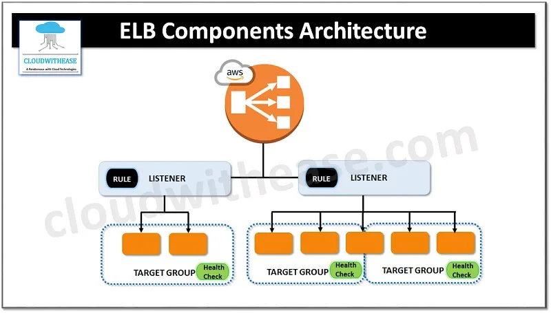

# Load Balancing & Auto Scaling

## 1. Overview

A **Load Balancer** distributes incoming requests across multiple backend resources.

```text
Client
   │
   ▼
Load Balancer
   │
   ├── Backend 1
   ├── Backend 2
   └── Backend 3
```

The main purposes of Load Balancing are:

- Distribute traffic across backend servers.
- Improve application availability.
- Prevent a single server from being overloaded.
- Support horizontal scaling.
- Automatically route traffic only to healthy targets.

---
## 2. Elastic Load Balancing (ELB)

**Elastic Load Balancing (ELB)** is a managed AWS service that automatically distributes incoming traffic across multiple targets.

Targets can include:

- EC2 Instances
- IP addresses
- Containers
- Lambda functions

ELB is commonly used to improve:

- High Availability
- Scalability
- Fault Tolerance

### Core Components

The main ELB components are:

- **Load Balancer**: The entry point that receives traffic from clients.
- **Listener**: Checks incoming connections on a configured protocol and port.
- **Listener Rule**: Determines how requests are routed.
- **Target Group**: A logical group of backend targets.
- **Health Check**: Checks whether targets are healthy.

### ELB Component Architecture



Typical traffic flow:

```text
Client
   │
   ▼
Load Balancer
   │
   ▼
Listener :80 / :443
   │
   ▼
Listener Rule
   │
   ▼
Target Group
   │
   ├── EC2 Instance 1
   ├── EC2 Instance 2
   └── EC2 Instance 3
```

---
## 3. Types of Load Balancer

AWS provides four types of Load Balancers.

### Application Load Balancer (ALB)

ALB operates at **Layer 7 – Application Layer**.

It is commonly used for HTTP and HTTPS applications.

ALB understands application-level information such as:

- HTTP headers
- Hostname
- URL path
- HTTP methods

ALB supports advanced routing.

Example:

```text
/shop/*  → Shop Target Group
/api/*   → API Target Group
/admin/* → Admin Target Group
```

Common use cases:

- Web applications
- REST APIs
- Microservices
- Container-based applications

---
### Network Load Balancer (NLB)

NLB operates mainly at **Layer 4 – Transport Layer**.

It supports:

- TCP
- UDP
- TLS

NLB is designed for high-performance and low-latency network traffic.

Common use cases:

- High-throughput applications
- TCP/UDP services
- Applications requiring static IP addresses
- Low-latency workloads

---
### Classic Load Balancer (CLB)

Classic Load Balancer is the previous generation of AWS Load Balancing.

It provides basic Layer 4 and Layer 7 load balancing capabilities.

For new applications, AWS generally recommends using:

- Application Load Balancer
- Network Load Balancer

CLB is mainly found in legacy AWS environments.

---
### Gateway Load Balancer (GWLB)

Gateway Load Balancer is used to deploy and scale **virtual network appliances**.

Examples:

- Firewalls
- Intrusion Detection Systems (IDS)
- Intrusion Prevention Systems (IPS)
- Deep Packet Inspection appliances

Typical architecture:

```text
Traffic
   │
   ▼
Gateway Load Balancer
   │
   ▼
Security Appliances
   │
   ├── Firewall 1
   ├── Firewall 2
   └── Firewall 3
```

GWLB works with network traffic and uses **GENEVE encapsulation on port 6081**.

It is mainly used in advanced network security architectures.

---
## 4. Target Groups and Listener Rules

A Load Balancer distributes traffic to targets inside a **Target Group**.

Example:

```text
Target Group: web-tg

├── EC2-01
├── EC2-02
└── EC2-03
```

The Load Balancer distributes requests between healthy targets.

When multiple Target Groups are used, **Listener Rules** determine where the request should be routed.

Common routing conditions include:

- Host header
- Path pattern
- HTTP header
- HTTP request method
- Query string
- Source IP

Example:

```text
example.com/api/*
        │
        ▼
API Target Group

example.com/images/*
        │
        ▼
Image Target Group
```

The Listener receives traffic on a configured port.

Example:

```text
HTTP  → Port 80
HTTPS → Port 443
```

The Listener Rule then evaluates the request and forwards it to the appropriate Target Group.

---
## 5. Cross-Zone Load Balancing

**Cross-Zone Load Balancing** allows a Load Balancer node in one Availability Zone to distribute traffic to targets in other enabled Availability Zones.

Example without Cross-Zone Load Balancing:

```text
AZ-A Load Balancer
   │
   ├── EC2-A1
   └── EC2-A2

AZ-B Load Balancer
   │
   └── EC2-B1
```

Traffic is distributed between Load Balancer nodes.

If each AZ receives 50% of traffic:

```text
AZ-A → 50% traffic → 2 instances
AZ-B → 50% traffic → 1 instance
```

The EC2 instance in AZ-B may receive more traffic than each instance in AZ-A.

With Cross-Zone Load Balancing:

```text
Load Balancer
   │
   ├── EC2-A1
   ├── EC2-A2
   └── EC2-B1
```

Traffic can be distributed across all healthy targets regardless of Availability Zone.

### Why use Cross-Zone Load Balancing?

It helps:

- Distribute traffic more evenly.
- Reduce imbalance between Availability Zones.
- Support architectures where each AZ has a different number of targets.

> Cross-Zone Load Balancing behavior and configuration can differ depending on the Load Balancer type.

---
## 6. Scaling

Scaling means adjusting infrastructure resources based on workload requirements.

There are two main scaling approaches.

### Vertical Scaling – Scale Up / Scale Down

Increase or decrease the resources of a server.

Example:

```text
t3.micro
   │
   ▼
t3.large
```

Resources that can be changed include:

- CPU
- Memory
- Instance size

Advantages:

- Simple architecture.
- Easy to manage.

Limitations:

- Hardware limits.
- May require downtime.
- A single server can still become a single point of failure.

---
### Horizontal Scaling – Scale Out / Scale In

Increase or decrease the number of instances.

Scale Out:

```text
2 Instances
     │
     ▼
5 Instances
```

Scale In:

```text
5 Instances
     │
     ▼
2 Instances
```

Horizontal Scaling is commonly used with:

```text
Load Balancer + Auto Scaling Group
```

This approach improves:

- Scalability
- High Availability
- Fault Tolerance

---
## 7. Auto Scaling Group (ASG)

An **Auto Scaling Group** manages a group of EC2 instances.

ASG automatically maintains the required number of instances.

Core components:

- Launch Template
- Minimum Capacity
- Maximum Capacity
- Desired Capacity
- Scaling Policies
- CloudWatch Metrics

Typical architecture:

```text
               Client
                  │
                  ▼
        Application Load Balancer
                  │
                  ▼
         Auto Scaling Group
            │     │     │
            ▼     ▼     ▼
          EC2   EC2   EC2
```

A common AWS architecture is:

```text
ALB + Target Group + ASG + CloudWatch
```

CloudWatch monitors metrics.

ASG adjusts the number of EC2 instances.

ALB distributes traffic to healthy instances.

---
## 8. Launch Template

A **Launch Template** defines how new EC2 instances should be created.

It can contain:

- AMI
- Instance Type
- Key Pair
- Security Group
- Storage configuration
- Network settings
- IAM Instance Profile
- User Data

Example:

```text
Launch Template
      │
      ├── AMI: Ubuntu
      ├── Instance Type: t3.micro
      ├── Security Group: web-sg
      └── User Data: install-nginx.sh
```

When ASG needs a new EC2 instance:

```text
ASG
 │
 ▼
Launch Template
 │
 ▼
Create EC2 Instance
```

Launch Templates are preferred over the older **Launch Configuration**.

A Launch Template also supports versioning.

---
## 9. Auto Scaling Methods

### No Scaling

The number of instances remains fixed.

Example:

```text
Desired Capacity = 3
```

ASG maintains three instances.

If one instance fails:

```text
3 Instances
    │
EC2 Failed
    │
    ▼
2 Instances
    │
    ▼
ASG launches 1 new EC2
```

ASG returns to the Desired Capacity of three instances.

---
### Manual Scaling

The administrator manually changes the Desired Capacity.

Example:

```text
Current Desired Capacity = 2

Change to:

Desired Capacity = 4
```

ASG launches two additional instances.

---
### Dynamic Scaling

ASG automatically scales based on monitored metrics.

CloudWatch can monitor metrics such as:

- CPU Utilization
- Network traffic
- ALB Request Count

Example:

```text
CPU > 70%
    │
    ▼
Scale Out

CPU < 30%
    │
    ▼
Scale In
```

A common approach is **Target Tracking Scaling**.

Example:

```text
Target CPU Utilization = 50%
```

ASG automatically adjusts the number of instances to keep average CPU utilization near 50%.

---
### Scheduled Scaling

Scheduled Scaling changes capacity at a predefined time.

Use it when workload patterns are predictable.

Example:

```text
08:00
Desired Capacity = 10

22:00
Desired Capacity = 2
```

Use cases:

- E-commerce traffic during business hours.
- Internal company applications.
- Scheduled batch workloads.
- Known peak traffic periods.

Example:

```text
Business Hours
08:00 → 18:00
10 Instances

Night
18:00 → 08:00
2 Instances
```

Scheduled Scaling is based on **time**, not real-time metrics.

---
### Predictive Scaling

Predictive Scaling analyzes historical traffic patterns and forecasts future capacity requirements.

Example:

```text
Historical Pattern

Every Monday 08:00
Traffic increases

        │
        ▼

Predictive Scaling
        │
        ▼

Scale Out before 08:00
```

Unlike Dynamic Scaling, Predictive Scaling can prepare capacity **before traffic increases**.

---
## 10. Min, Max and Desired Capacity

An Auto Scaling Group uses three important capacity values.

### Minimum Capacity

The minimum number of instances ASG must maintain.

Example:

```text
Min = 2
```

ASG will not scale below two instances.

---
### Maximum Capacity

The maximum number of instances ASG can create.

Example:

```text
Max = 10
```

ASG cannot scale beyond ten instances.

---
### Desired Capacity

The number of instances ASG currently attempts to maintain.

Example:

```text
Min     = 2
Desired = 4
Max     = 10
```

ASG attempts to maintain four instances.

If the cluster currently has two instances:

```text
Current = 2
Desired = 4
```

ASG launches two additional instances.

```text
2 EC2
  │
  ▼
Launch 2 EC2
  │
  ▼
4 EC2
```

The basic rule is:

```text
Min ≤ Desired ≤ Max
```

ASG always attempts to maintain the current Desired Capacity.

---
## 11. ELB Session Stickiness

**Session Stickiness** allows the Load Balancer to route requests from the same client to the same target.

Without Stickiness:

```text
Request 1 → EC2-A
Request 2 → EC2-B
Request 3 → EC2-C
```

With Stickiness:

```text
User A
  │
  ├── Request 1
  ├── Request 2
  └── Request 3
          │
          ▼
        EC2-A
```

### ELB Stickiness Architecture

Stickiness commonly uses **cookies**.

Typical flow:

```text
Client
   │
   ▼
Application Load Balancer
   │
   ▼
Select EC2-A
   │
   ▼
Cookie is created
   │
   ▼
Client sends cookie
   │
   ▼
ALB routes client back to EC2-A
```
### When should I use Stickiness?

Use Stickiness when an application stores session data locally on the backend server.

Example:

```text
User Login Session
Shopping Cart
Temporary User State
```

If the user logs in through EC2-A and the next request goes to EC2-B, EC2-B may not know the user's session.

Stickiness keeps the client connected to the same backend.

### Limitations

Stickiness can cause uneven traffic distribution.

Example:

```text
EC2-A → 100 sticky users
EC2-B → 20 sticky users
EC2-C → 10 sticky users
```

Therefore, modern applications often store session data in external systems such as:

```text
Amazon ElastiCache
Database
Distributed Session Store
```

This allows backend instances to remain **stateless**.

Example:

```text
             ALB
          /   |   \
       EC2-A EC2-B EC2-C
          \   |   /
           ElastiCache
```

Any EC2 instance can process the user's request because session data is stored externally.

---
## 12. Common Use Cases

### Highly Available Web Application

```text
Internet
   │
   ▼
ALB
   │
   ▼
Auto Scaling Group
   │
   ├── EC2 AZ-A
   ├── EC2 AZ-B
   └── EC2 AZ-C
```

Use when building scalable and highly available web applications.

### Microservices Routing

```text
ALB
 │
 ├── /users   → User Service
 ├── /orders  → Order Service
 └── /payment → Payment Service
```

Use ALB Path-Based Routing to route requests to different services.

### Automatic Traffic Scaling

```text
Traffic Increase
       │
       ▼
CloudWatch Metric
       │
       ▼
ASG Scale Out
       │
       ▼
New EC2 Instances
       │
       ▼
Register with Target Group
       │
       ▼
ALB distributes traffic
```

---
## Key Takeaways

- Load Balancers distribute traffic across backend targets.
- ELB provides managed Load Balancing on AWS.
- ALB operates at Layer 7 and supports advanced HTTP routing.
- NLB operates at Layer 4 and is designed for high-performance network traffic.
- Target Groups contain backend resources.
- Listener Rules determine where requests are routed.
- Cross-Zone Load Balancing helps distribute traffic across Availability Zones.
- Scale Up/Down changes server resources.
- Scale Out/In changes the number of servers.
- Auto Scaling Groups maintain EC2 capacity automatically.
- Launch Templates define how new EC2 instances are created.
- Scheduled Scaling is used for predictable workloads.
- Predictive Scaling forecasts future capacity requirements.
- Desired Capacity represents the number of instances ASG attempts to maintain.
- Session Stickiness keeps a client connected to the same backend target.