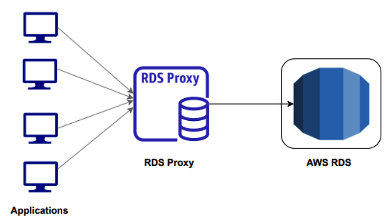

# Amazon RDS - Relational Database Service

## 1. Overview

**Amazon RDS (Relational Database Service)** is a managed relational database service provided by AWS.

Instead of manually installing and managing a database on EC2, AWS handles many administrative tasks such as:

- Infrastructure provisioning
- Database installation
- Backup
- Software patching
- Failure detection
- Recovery

Basic architecture:

```text
Application
     │
     ▼
RDS Endpoint
     │
     ▼
RDS Database
```

Amazon RDS supports common relational database engines:

- MySQL
- PostgreSQL
- MariaDB
- Oracle Database
- Microsoft SQL Server
- IBM Db2

Amazon Aurora is an AWS-built relational database engine compatible with MySQL and PostgreSQL.

---
## 2. When and Where is RDS Used?

RDS is used when an application requires a **relational database** and structured data.

Typical data relationships:

```text
Users
  │
  ├── Orders
  │      │
  │      └── Order Items
  │
  └── Payments
```

RDS is suitable when the application requires:

- SQL queries
- Transactions
- Data relationships
- Data consistency
- Managed backups
- High Availability

Instead of:

```text
EC2
 │
 ▼
Install PostgreSQL
 │
 ▼
Configure Database
 │
 ▼
Configure Backup
 │
 ▼
Configure Replication
 │
 ▼
Monitor Database
```

RDS provides:

```text
Create RDS
    │
    ▼
Select DB Engine
    │
    ▼
Configure Database
    │
    ▼
AWS manages infrastructure
```

---
## 3. RDS Features

Important RDS features include:

- Rapid DB instance provisioning
- Managed database infrastructure
- Automated backups
- Manual snapshots
- Multi-AZ deployments
- Read Replicas
- Storage scaling
- Monitoring with CloudWatch
- Encryption with AWS KMS
- Integration with IAM
- Database performance monitoring

RDS allows administrators to focus more on:

```text
Database Design
SQL
Performance
Application
```

Instead of managing:

```text
Physical Server
Operating System
Database Installation
Hardware Failure
```

---
## 4. Common RDS Use Cases

### E-Commerce Applications

Store:

- Customers
- Products
- Orders
- Payments
- Inventory

Example:

```text
Customer
   │
   ▼
Order
   │
   ▼
Order Items
```

---
### User Management Systems

Store:

- User accounts
- Profiles
- Roles
- Permissions

Example:

```text
User
 │
 ├── Profile
 ├── Role
 └── Permission
```

---
### Education Systems

Store:

- Students
- Teachers
- Courses
- Grades
- Enrollments

---
### Banking and Financial Applications

Relational databases are suitable for applications requiring:

- Transactions
- Data consistency
- Structured relationships

Examples:

```text
Account
Transaction
Payment
Invoice
```

---
### Enterprise Applications

Examples:

- ERP
- CRM
- HR Management
- Inventory Management

---
### SaaS Applications

RDS can store application data for Software as a Service platforms.

Example:

```text
SaaS Application
       │
       ▼
      RDS
       │
       ├── Users
       ├── Organizations
       ├── Subscriptions
       └── Application Data
```

---
## 5. RDS Deployment Models

There are several common RDS deployment architectures.

### Single DB Instance

A single DB instance is deployed in one Availability Zone.

```text
Application
     │
     ▼
DB Instance
   AZ-A
```

Characteristics:

- Simple architecture
- Lower cost
- No standby instance in another AZ

Common use cases:

- Development
- Testing
- Lab environments
- Non-critical applications

Main limitation:

```text
DB Instance Failure
        │
        ▼
Database Unavailable
```

---
### Multi-AZ DB Instance Deployment

A primary DB instance is deployed with a standby DB instance in another Availability Zone.

```text
              Application
                   │
                   ▼
             RDS Endpoint
                   │
                   ▼
            Primary Instance
                 AZ-A
                   │
          Synchronous Replication
                   │
                   ▼
            Standby Instance
                 AZ-B
```

The Primary instance handles application traffic.

The Standby instance is maintained for High Availability.

If the Primary instance fails:

```text
Primary Failure
      │
      ▼
Automatic Failover
      │
      ▼
Standby becomes Primary
```

The application continues using the RDS endpoint.

### Important

The Standby instance is primarily used for **High Availability**.

It is not the same as a Read Replica.

```text
Multi-AZ Standby → High Availability

Read Replica → Read Scaling
```

Common use cases:

- Production databases
- Business-critical applications
- Applications requiring High Availability

---
### RDS Read Replica

A Read Replica is a read-only copy of a source database.

```text
             Primary DB
             Read / Write
                  │
                  │ Replication
          ┌───────┴───────┐
          ▼               ▼
    Read Replica 1   Read Replica 2
       Read Only        Read Only
```

The Primary database handles:

```text
INSERT
UPDATE
DELETE
SELECT
```

Read Replicas mainly handle:

```text
SELECT
```

Application architecture:

```text
Write Request
     │
     ▼
Primary DB

Read Request
     │
     ▼
Read Replica
```

Read Replicas are used to:

- Scale read-heavy workloads
- Reduce load on the Primary DB
- Run reporting queries
- Run analytics workloads

Example:

```text
E-Commerce Application

Orders / Payments
       │
       ▼
Primary DB

Product Search
Reports
Analytics
       │
       ▼
Read Replicas
```

Replication to a Read Replica can have replication lag.

Therefore, a Read Replica might not immediately contain the latest data.

---
### Read Replica with Multi-AZ

A Read Replica can also use a Multi-AZ deployment where supported.

Conceptually:

```text
Primary DB
    │
    ▼
Read Replica
    │
    ▼
Multi-AZ Standby
```

This combines:

```text
Read Scaling
     +
High Availability for the replica
```

This architecture can be useful when the Read Replica itself supports an important workload.

---
### Multi-AZ DB Cluster

Amazon RDS also supports a Multi-AZ DB Cluster architecture for supported engines.

Typical architecture:

```text
               Writer Instance
                    AZ-A
                     │
             Synchronous Replication
              ┌──────┴──────┐
              ▼             ▼
       Reader Instance   Reader Instance
             AZ-B              AZ-C
```

The cluster contains:

- 1 Writer DB instance
- 2 readable DB instances

The Writer handles:

```text
Read
Write
```

The Reader instances can handle:

```text
Read
```

Compared with a traditional Multi-AZ DB Instance deployment:

```text
Multi-AZ DB Instance

Primary
   │
   ▼
Standby

Standby is mainly for HA
```

```text
Multi-AZ DB Cluster

Writer
   │
   ├── Reader
   └── Reader

Readers can serve read traffic
```

The Multi-AZ DB Cluster architecture provides:

- High Availability
- Read scaling
- Faster failover architecture

---
## 6. RDS Cluster Concept

A database cluster is a group of database instances working together.

A common cluster architecture contains:

```text
             Writer / Primary
              Read + Write
                    │
          ┌─────────┼─────────┐
          ▼         ▼         ▼
       Reader 1  Reader 2  Reader 3
       Read Only Read Only Read Only
```

The Writer instance handles database modifications.

Examples:

```text
INSERT
UPDATE
DELETE
```

Reader instances handle read workloads.

Example:

```text
SELECT
```

This architecture separates:

```text
Write Workload
      │
      ▼
Writer

Read Workload
      │
      ▼
Readers
```

The main benefits are:

- Read scalability
- High Availability
- Workload distribution

> The exact number of readers and cluster architecture depends on the RDS engine and deployment type.

---
## 7. Amazon Aurora

**Amazon Aurora** is a relational database engine developed by AWS.

Aurora is compatible with:

- MySQL
- PostgreSQL

Typical Aurora architecture:

```text
             Aurora Cluster
                   │
          ┌────────┴────────┐
          │                 │
     Writer Instance   Reader Instances
       Read / Write        Read Only
          │                 │
          └────────┬────────┘
                   │
                   ▼
          Aurora Cluster Volume
```

An Aurora DB Cluster normally contains:

- One Writer instance
- Zero or more Aurora Replicas

A standard Aurora cluster can have up to **15 Aurora Replicas**.

---
## 8. Aurora Cluster Storage

Aurora separates database compute from database storage.

Traditional database concept:

```text
DB Instance
    │
    ▼
Local Database Storage
```

Aurora architecture:

```text
Writer
   │
   ├──────────┐
   │          │
Reader 1   Reader 2
   │          │
   └─────┬────┘
         ▼
Shared Cluster Volume
```

The database instances connect to a shared **Cluster Volume**.

Aurora storage is distributed across multiple Availability Zones.

Conceptually:

```text
        Aurora Cluster Volume

        AZ-A      AZ-B      AZ-C
         │         │         │
      Storage   Storage   Storage
```

This architecture improves:

- Data durability
- High Availability
- Failure recovery

Because compute and storage are separated, Aurora Readers do not require separate full copies of the database storage.

---
## 9. Aurora Endpoints

Aurora provides different endpoints for database connections.

### Cluster / Writer Endpoint

Used for read and write operations.

```text
Application
     │
     ▼
Writer Endpoint
     │
     ▼
Writer Instance
```

Use for:

```text
INSERT
UPDATE
DELETE
SELECT
```

---
### Reader Endpoint

Used for read-only workloads.

```text
Application
     │
     ▼
Reader Endpoint
     │
     ▼
Aurora Readers
```

Conceptually:

```text
Reader Endpoint
      │
      ├── Reader 1
      ├── Reader 2
      └── Reader 3
```

Use for:

- Reports
- Search
- Analytics
- Read-heavy workloads

---
## 10. Aurora Global Database

**Aurora Global Database** allows an Aurora database to span multiple AWS Regions.

Architecture:

```text
             Primary Region
             ap-southeast-1
                    │
                    ▼
             Aurora Cluster
                    │
          Cross-Region Replication
             ┌──────┴──────┐
             ▼             ▼
      Secondary Region  Secondary Region
         us-east-1        eu-west-1
```

The Primary Region handles write workloads.

Secondary Regions can provide local read access.

Common use cases:

- Global applications
- Disaster Recovery
- Low-latency regional reads

Example:

```text
Asia Users
    │
    ▼
Asia Aurora Cluster

Europe Users
    │
    ▼
Europe Secondary Cluster
```

---
## 11. Aurora Backtrack

**Aurora Backtrack** allows a supported Aurora MySQL DB cluster to be moved back to an earlier point in time.

Example:

```text
10:00 Database Normal
        │
        ▼
10:30 DELETE FROM users;
        │
        ▼
Data Accidentally Deleted
        │
        ▼
Backtrack to 10:29
```

Backtrack concept:

```text
Current Database State
          │
          ▼
     Backtrack
          │
          ▼
Previous Database State
```

Common use cases:

- Accidental DELETE
- Accidental UPDATE
- Application deployment errors
- Data corruption caused by application logic

### Important

Aurora Backtrack is **not a replacement for backups**.

```text
Backtrack
   ≠
Backup
```

Backtrack is designed to quickly rewind the database state.

Backups and snapshots are still required for data protection and recovery strategies.

---
## 12. Aurora Serverless

**Aurora Serverless** is an on-demand, automatically scaling configuration for Amazon Aurora.

Traditional database:

```text
Choose DB Instance Size
        │
        ▼
db.r6g.large
        │
        ▼
Fixed Compute Capacity
```

Aurora Serverless:

```text
Application Traffic
        │
        ▼
Aurora Serverless
        │
        ▼
Automatically Adjust Capacity
```

When workload increases:

```text
Traffic ↑
   │
   ▼
Database Capacity ↑
```

When workload decreases:

```text
Traffic ↓
   │
   ▼
Database Capacity ↓
```

Aurora Serverless is suitable for:

- Variable workloads
- Development environments
- Test environments
- Applications with unpredictable traffic
- Applications with intermittent database usage

Example:

```text
Normal Traffic
      │
      ▼
Low DB Capacity

Flash Sale
      │
      ▼
High DB Capacity

Traffic Decreases
      │
      ▼
Scale Down
```

---
## 13. DB Parameter Groups

A **DB Parameter Group** acts as a configuration container for database engine settings.

Conceptually:

```text
DB Parameter Group
        │
        ├── Database Parameters
        ├── Memory Settings
        ├── Connection Settings
        └── Engine Configuration
                │
                ▼
           DB Instance
```

Examples of database parameters:

```text
max_connections
log_statement
work_mem
shared_buffers
time_zone
```

The exact parameters depend on the database engine.

Example:

```text
PostgreSQL Parameter Group
          │
          ├── max_connections
          ├── log_statement
          └── work_mem
```

Parameter Groups are used to:

- Tune database performance
- Configure database behavior
- Configure logging
- Adjust connection limits

### Static and Dynamic Parameters

Some parameters can be applied immediately.

```text
Dynamic Parameter
       │
       ▼
Apply without reboot
```

Other parameters require a DB reboot.

```text
Static Parameter
       │
       ▼
Change Parameter
       │
       ▼
Reboot DB
```
### Important

The Default Parameter Group should generally not be treated as a custom tuning configuration.

Create a custom Parameter Group when database settings need to be modified.

---
## 14. Amazon RDS Proxy

**Amazon RDS Proxy** is a fully managed database proxy service.

It sits between the application and the database.

### RDS Proxy Architecture



Basic architecture:

```text
Application
     │
     ▼
RDS Proxy
     │
     ▼
RDS / Aurora
```

Without RDS Proxy:

```text
Application Instance 1 ──┐
Application Instance 2 ──┤
Application Instance 3 ──┼──► Database
Application Instance 4 ──┤
Application Instance 5 ──┘
```

Each application can create database connections.

When the number of applications increases:

```text
Applications ↑
      │
      ▼
DB Connections ↑
      │
      ▼
Database Overload
```

RDS Proxy introduces a connection pool.

```text
Applications
     │
     │ Many Application Connections
     ▼
RDS Proxy
     │
     │ Shared Database Connections
     ▼
Database
```

RDS Proxy pools and reuses database connections.

---
## 15. Why Use RDS Proxy?

### Connection Pooling

RDS Proxy maintains and reuses database connections.

Instead of:

```text
Request
   │
   ▼
Create DB Connection
   │
   ▼
Query
   │
   ▼
Close Connection
```

RDS Proxy can reuse existing connections.

```text
Application Request
        │
        ▼
RDS Proxy
        │
        ▼
Reuse DB Connection
```

This reduces connection overhead.

---
### Protect the Database from Connection Storms

Serverless and Auto Scaling applications can rapidly create many application instances.

Example:

```text
AWS Lambda
   │
   ├── 100 Functions
   ├── 500 Functions
   └── 1000 Functions
```

Without RDS Proxy:

```text
1000 Lambda Functions
        │
        ▼
1000+ DB Connections
        │
        ▼
Database Overload
```

With RDS Proxy:

```text
1000 Lambda Functions
        │
        ▼
RDS Proxy
        │
        ▼
Connection Pool
        │
        ▼
Database
```

RDS Proxy is especially useful for:

- AWS Lambda
- Auto Scaling applications
- Microservices
- Applications with unpredictable connection spikes

---
### Improve Database Failover Handling

RDS Proxy can help applications remain resilient during database failover.

Conceptually:

```text
Application
     │
     ▼
RDS Proxy
     │
     ▼
Primary DB
```

If the Primary DB fails:

```text
Primary Failure
      │
      ▼
Database Failover
      │
      ▼
RDS Proxy reconnects to new DB target
```

The application continues connecting through the Proxy endpoint.

---
## 16. RDS Proxy Use Cases

### AWS Lambda with RDS

```text
Lambda Functions
       │
       ▼
    RDS Proxy
       │
       ▼
      RDS
```

RDS Proxy prevents Lambda functions from creating excessive database connections.

---

### Auto Scaling Application

```text
Application Load Balancer
          │
          ▼
    Auto Scaling Group
       │   │   │
      EC2 EC2 EC2
       \   |   /
        RDS Proxy
            │
            ▼
           RDS
```

When ASG scales out, new EC2 instances can connect through RDS Proxy.

---
### Microservices

```text
User Service ─────┐
Order Service ────┤
Payment Service ──┼──► RDS Proxy ──► RDS
Inventory Service ┘
```

RDS Proxy helps manage database connections from multiple application services.

---
## 17. RDS vs Database on EC2

| Feature | RDS | Database on EC2 |
|---|---|---|
| Infrastructure | AWS Managed | User Managed |
| OS Access | No | Yes |
| Database Installation | Managed | Manual |
| Backup | Automated | User Managed |
| Patching | Managed | User Managed |
| High Availability | Multi-AZ | Build manually |
| OS Control | Limited | Full Control |
| Database Customization | Limited | High |
| Administration | Easier | More complex |

Use RDS when:

```text
Focus on Application
Managed Database
Automated Backup
High Availability
```

Use a database on EC2 when:

```text
Need OS Access
Custom Database Installation
Special Database Configuration
Full Infrastructure Control
```

---
## Key Takeaways

- Amazon RDS is a managed relational database service.
- RDS reduces database infrastructure management tasks.
- Single DB Instance is suitable for development and testing workloads.
- Multi-AZ DB Instance is primarily designed for High Availability.
- A Multi-AZ Standby is not the same as a Read Replica.
- Read Replicas are used to scale read workloads.
- Multi-AZ DB Clusters provide a writer and readable standby instances for supported engines.
- Aurora is an AWS-built relational database engine compatible with MySQL and PostgreSQL.
- Aurora separates database compute from shared cluster storage.
- Aurora supports up to 15 Aurora Replicas in a standard DB cluster.
- Aurora Global Database supports multi-Region database architectures.
- Aurora Backtrack can quickly rewind supported Aurora MySQL clusters but does not replace backups.
- Aurora Serverless automatically adjusts database capacity based on workload.
- Parameter Groups control database engine configuration.
- RDS Proxy pools and reuses database connections.
- RDS Proxy is useful for Lambda, Auto Scaling, and applications with connection spikes.