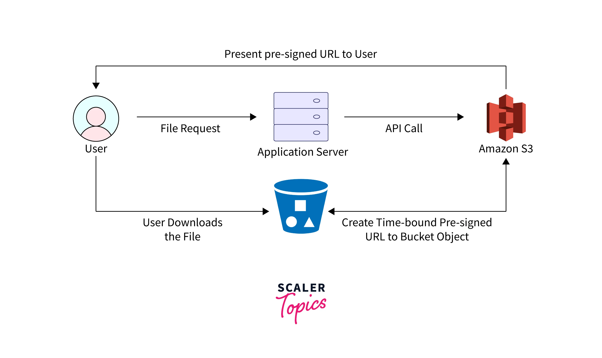
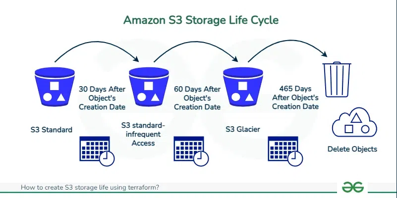

# Amazon S3 (Simple Storage Service)

## 1. What is Amazon S3?

Amazon S3 is a fully managed **object storage service** provided by AWS.

S3 stores data as **objects inside buckets**.

```text
S3 Bucket
│
├── image.png
├── index.html
├── backup.zip
└── logs/
    └── access.log
```

S3 is commonly used to store:

* Website files
* Images and videos
* Mobile application data
* Backups
* Log files
* Static content
* Data for analytics

Unlike EBS, S3 is **object storage** and does not need to be mounted to an EC2 instance to access data.

---
## 2. When should I use S3?

Use Amazon S3 when applications need scalable and durable object storage.

Common scenarios:

* Store static website files.
* Store images and videos.
* Backup application data.
* Store application or infrastructure logs.
* Store build artifacts.
* Store data for analytics.
* Distribute static content with CloudFront.

S3 is not suitable as a traditional block disk for an EC2 instance.

For EC2 disks, use **Amazon EBS**.

---
## 3. Common Use Cases

* Static website hosting
* Application file storage
* Backup and restore
* Log storage
* CI/CD artifacts
* Data lake
* Media storage
* CloudFront origin

Example architecture:

```text
User
 │
 ▼
CloudFront
 │
 ▼
S3 Bucket
 │
 ├── HTML
 ├── CSS
 ├── JavaScript
 └── Images
```

---
# S3 Core Features

Amazon S3 provides several important features:

* Storage Classes
* Storage Management
* Access Management
* Data Processing
* Logging and Monitoring
* Analytics and Insights
* Versioning
* Lifecycle Management
* Strong Consistency

S3 provides strong read-after-write consistency for object operations.

---
# S3 Bucket and Object

A **Bucket** is a container used to store objects.

An **Object** is the actual data stored in S3.

Each object contains:

* Object data
* Object key
* Metadata

Example:

```text
Bucket: my-website

Object Key:
images/logo.png
```

The full object structure is:

```text
my-website
└── images
    └── logo.png
```

S3 does not use traditional folders.

The folder structure displayed in the AWS Console is based on **object key prefixes**.

---
# S3 Policy and ACL

S3 access can be controlled using:

* IAM Policies
* Bucket Policies
* Access Control Lists (ACLs)

## Bucket Policy

A Bucket Policy is a resource-based policy attached directly to an S3 bucket.

It uses JSON syntax similar to an IAM Policy.

Example:

```json
{
  "Version": "2012-10-17",
  "Statement": [
    {
      "Effect": "Allow",
      "Principal": "*",
      "Action": "s3:GetObject",
      "Resource": "arn:aws:s3:::my-bucket/*"
    }
  ]
}
```

Important elements:

* `Effect` – Allow or Deny
* `Principal` – who can access
* `Action` – allowed S3 operation
* `Resource` – S3 resource

## ACL

ACL is an older access control mechanism used to control access to buckets and objects.

For most modern environments:

> Prefer IAM Policies and Bucket Policies instead of ACLs.

ACLs should only be used when a specific use case requires them.

---
# S3 Versioning

S3 Versioning keeps multiple versions of the same object.

Example:

```text
config.json
│
├── Version 1
├── Version 2
└── Version 3
```

Benefits:

* Recover accidentally deleted objects.
* Restore previous object versions.
* Protect against accidental overwrites.

When an object is deleted from a versioned bucket, S3 normally creates a **Delete Marker**.

The previous versions still exist.

```text
Object
│
├── Version 1
├── Version 2
└── Delete Marker
```

Removing the Delete Marker can make the object visible again.

Versioning is commonly used for:

* Important configuration files
* Backups
* Application data
* Critical objects

---
# S3 Presigned URL

An S3 Presigned URL provides **temporary access to a private S3 object**.

The bucket or object does not need to be publicly accessible.

## Concept



Typical flow:

```text
User
 │
 │ Request file
 ▼
Application
 │
 │ Authenticate User
 ▼
Generate Presigned URL
 │
 ▼
User receives temporary URL
 │
 ▼
Amazon S3
 │
 ▼
Download Object
```

The URL contains temporary authorization information and an expiration time.

## When should I use Presigned URLs?

Use Presigned URLs when:

* A private object needs temporary access.
* Users must authenticate before downloading a file.
* Access should expire automatically.
* The application should not expose the entire S3 bucket.

## Common Use Cases

* Private file download
* Temporary document sharing
* User avatar upload
* Backup download
* Secure media access

Example:

```text
Private S3 Object
        │
        ▼
Presigned URL
        │
        ▼
Valid for 15 minutes
        │
        ▼
User downloads file
```

---
# S3 Storage Classes

S3 provides multiple Storage Classes for different access patterns and cost requirements.

Storage Class selection depends on:

* Durability requirements
* Availability requirements
* Storage duration
* Access frequency
* Retrieval time
* Workload type
* Cost

---
## S3 Standard

General-purpose storage for frequently accessed data.

Suitable for:

* Websites
* Applications
* Frequently accessed files
* Dynamic content

Use S3 Standard when the access pattern is frequent or unpredictable.

---
## S3 Intelligent-Tiering

Automatically moves objects between access tiers based on access patterns.

Suitable for data with unpredictable access patterns.

S3 monitors object access and automatically optimizes storage cost.

Small objects may not receive the same automatic tiering cost benefits, so object size should be considered when choosing Intelligent-Tiering.

Common use cases:

* Data lakes
* Long-term application data
* Unknown access patterns

---
## S3 Standard-IA

IA stands for **Infrequent Access**.

Designed for data that is accessed less frequently but still requires rapid retrieval.

Suitable for:

* Backups
* Disaster recovery data
* Long-term application files

Storage cost is lower than S3 Standard, but retrieval charges apply.

---
## S3 One Zone-IA

Stores data in a single Availability Zone.

Lower cost than Standard-IA.

Suitable for:

* Re-creatable data
* Secondary backups
* Non-critical data

Do not use it for critical data that requires multi-AZ resilience.

---
## S3 Glacier

Designed for long-term archive storage.

Suitable for:

* Long-term backups
* Compliance archives
* Historical data

Glacier storage options provide lower storage costs but may have different retrieval times and costs.

Common Glacier classes include:

* S3 Glacier Instant Retrieval
* S3 Glacier Flexible Retrieval
* S3 Glacier Deep Archive

---
## S3 on Outposts

Provides S3 object storage in an on-premises environment using AWS Outposts.

Suitable for workloads that require:

* Local data processing
* Data residency
* Low-latency access to on-premises systems

---
# S3 Lifecycle

S3 Lifecycle allows AWS to automatically manage objects based on predefined rules.

Lifecycle rules can:

* Move objects to cheaper Storage Classes.
* Delete old objects.
* Delete old object versions.
* Remove expired delete markers.
* Clean up incomplete multipart uploads.

## Concept



Example:

```text
S3 Standard
     │
     │ After 30 days
     ▼
Standard-IA
     │
     │ After 90 days
     ▼
Glacier
     │
     │ After 365 days
     ▼
Delete
```

## Common Use Case

Application logs:

```text
0 - 30 days
S3 Standard

30 - 90 days
Standard-IA

90+ days
Glacier

After 1 year
Delete
```

Lifecycle policies help reduce storage costs and automate data management.

---
# S3 Static Website Hosting

Amazon S3 can host a **static website**.

Supported content:

* HTML
* CSS
* JavaScript
* Images

S3 cannot directly execute server-side application code such as:

* PHP
* Node.js
* Python
* Java

## Enable Static Website Hosting

Go to:

```text
S3
→ Bucket
→ Properties
→ Static website hosting
→ Enable
```

Configure:

```text
Index document: index.html
Error document: error.html
```

---
## Public Access Configuration

A static website must allow users to read website objects when using the public S3 website endpoint.

Configure:

```text
Permissions
→ Block Public Access
```

Review and modify the public access settings if public website access is required.

Then configure a Bucket Policy.

Example:

```json
{
  "Version": "2012-10-17",
  "Statement": [
    {
      "Effect": "Allow",
      "Principal": "*",
      "Action": "s3:GetObject",
      "Resource": "arn:aws:s3:::my-website/*"
    }
  ]
}
```

The `/*` is important because the permission applies to **objects inside the bucket**.

Example:

```text
arn:aws:s3:::my-website
```

represents the bucket.

```text
arn:aws:s3:::my-website/*
```

represents objects inside the bucket.

---
# S3 with CloudFront

S3 is commonly used with Amazon CloudFront.

Architecture:

```text
User
 │
 ▼
CloudFront CDN
 │
 ▼
S3 Bucket
```

Benefits:

* Lower latency
* Global content delivery
* HTTPS support
* Caching
* Reduced direct access to S3

For production environments, S3 is commonly kept private and CloudFront is used as the public entry point.

---
# CORS

S3 supports Cross-Origin Resource Sharing (CORS).

CORS controls whether a web application from one origin can access resources from another origin.

Example:

```text
Frontend:
https://example.com

S3:
https://my-bucket.s3.amazonaws.com
```

If the frontend accesses S3 directly, a CORS configuration may be required.

---
# Best Practices

* Enable Versioning for important buckets.
* Use Lifecycle Rules to optimize storage costs.
* Prefer Bucket Policies and IAM Policies over ACLs.
* Keep S3 buckets private by default.
* Use Presigned URLs for temporary private object access.
* Use CloudFront to distribute static content globally.
* Avoid exposing entire buckets publicly.
* Apply the Principle of Least Privilege.
* Enable logging and monitoring for important buckets.

---
# Common Mistakes

* Making the entire bucket public unnecessarily.
* Forgetting `/*` in the object ARN of a Bucket Policy.
* Confusing S3 with EBS.
* Storing Access Keys in application source code.
* Forgetting to configure CORS.
* Keeping old object versions without Lifecycle Rules.
* Using S3 Standard for long-term archive data.

---
# Key Takeaways

* Amazon S3 is a managed object storage service.
* Data is stored as objects inside buckets.
* S3 Versioning protects against accidental deletion and overwrites.
* Presigned URLs provide temporary access to private objects.
* Storage Classes help optimize storage cost.
* Lifecycle Rules automatically transition or delete objects.
* S3 can host static websites.
* S3 is commonly integrated with CloudFront for CDN and HTTPS.
* S3 buckets should remain private by default whenever possible.
