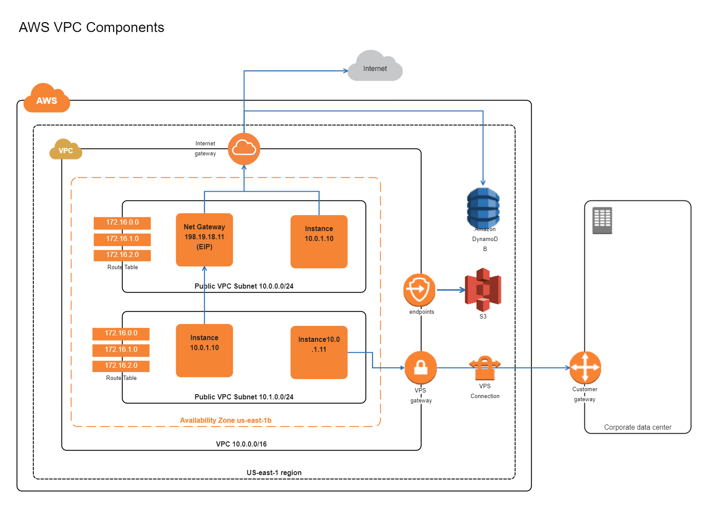
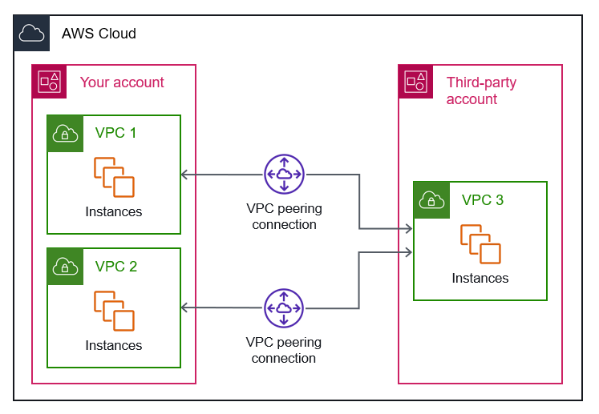

# Amazon VPC - Virtual Private Cloud

## 1. Overview

**Amazon VPC (Virtual Private Cloud)** is a logically isolated virtual network in AWS.

A VPC is a **Regional resource** and can contain resources across multiple Availability Zones.

```text
AWS Region
    │
    ▼
VPC
    │
    ├── AZ-A
    │    ├── Public Subnet
    │    └── Private Subnet
    │
    └── AZ-B
         ├── Public Subnet
         └── Private Subnet
```

VPC allows us to control:

- IP address ranges
- Subnets
- Routing
- Internet connectivity
- Network security
- Private AWS service connectivity
- Connections between networks

---
## 2. When and Where is VPC Used?

VPC is used to build and isolate network infrastructure on AWS.

Common use cases:

- Host web applications.
- Build multi-tier architectures.
- Isolate databases in private subnets.
- Connect multiple VPCs.
- Connect AWS with on-premises networks.
- Control inbound and outbound traffic.

Example:

```text
Internet
    │
    ▼
Application Load Balancer
    │
    ▼
EC2 Application
    │
    ▼
RDS Database
```

Each layer can be placed in a different subnet and protected by different network rules.

---
## 3. VPC Core Components

### VPC

A VPC is a virtual network created at the **Region level**.

A VPC is defined using a CIDR block.

Example:

```text
10.0.0.0/16
```

---
### Subnet

A Subnet is a smaller IP range inside a VPC.

Each subnet belongs to **one Availability Zone**.

Example:

```text
VPC: 10.0.0.0/16

├── Public-A  : 10.0.1.0/24 → AZ-A
├── Private-A : 10.0.2.0/24 → AZ-A
├── Public-B  : 10.0.3.0/24 → AZ-B
└── Private-B : 10.0.4.0/24 → AZ-B
```

A subnet cannot span multiple Availability Zones.

---
### Route Table

A Route Table determines where network traffic is sent.

Example:

```text
Destination      Target

10.0.0.0/16      local
0.0.0.0/0        Internet Gateway
```

Route Tables are associated with subnets.

A subnet is considered **public** when its Route Table has a route to an Internet Gateway.

```text
0.0.0.0/0 → Internet Gateway
```

A private subnet normally does not have a direct route to an Internet Gateway.

---
### Internet Gateway - IGW

An Internet Gateway provides Internet connectivity for a VPC.

```text
Internet
    │
    ▼
Internet Gateway
    │
    ▼
VPC
```

The Internet Gateway must be attached to the VPC.

For an EC2 instance to communicate directly with the Internet, it generally requires:

- A route to the Internet Gateway.
- A Public IPv4 address or Elastic IP.
- Appropriate Security Group and Network ACL rules.

---
### NAT Gateway

A NAT Gateway allows resources in a **private subnet to initiate outbound Internet connections**.

```text
Private EC2
    │
    ▼
NAT Gateway
    │
    ▼
Internet Gateway
    │
    ▼
Internet
```

The Internet cannot directly initiate a connection to the private EC2 instance through the NAT Gateway.

Common use cases:

- Download packages.
- Update the operating system.
- Access external APIs.

A public NAT Gateway is normally deployed in a **public subnet**.

The private subnet Route Table uses:

```text
0.0.0.0/0 → NAT Gateway
```

---
### Security Group

A Security Group acts as a virtual firewall for supported AWS resources such as EC2 network interfaces.

Security Groups are **stateful**.

```text
Allowed Request
      │
      ▼
EC2
      │
      ▼
Response automatically allowed
```

Security Groups support **Allow rules only**.

Example:

```text
Inbound

SSH   TCP 22   My IP
HTTP  TCP 80   0.0.0.0/0
```

A resource can be associated with multiple Security Groups.

---
### Network ACL - NACL

A Network ACL controls traffic at the **Subnet level**.

NACLs are **stateless**.

Therefore, inbound and outbound traffic must be allowed separately.

Rules contain:

- Rule number
- Allow or Deny
- Protocol
- Port range
- Source or destination CIDR

Example:

```text
Inbound  → Allow
Outbound → Allow
```

Rules are evaluated by rule number, starting from the lowest number.

The default Network ACL allows all inbound and outbound traffic.

---
### Security Group vs Network ACL

| Feature | Security Group | Network ACL |
|---|---|---|
| Level | Resource / ENI | Subnet |
| State | Stateful | Stateless |
| Rules | Allow only | Allow and Deny |
| Rule Priority | No numbered priority | Rule number |
| Return Traffic | Automatically allowed | Must be explicitly allowed |

Easy way to remember:

```text
Security Group → Protect Resource
NACL           → Protect Subnet
```

---
### Elastic IP - EIP

An Elastic IP is a static public IPv4 address allocated to an AWS account.

It can be associated with supported AWS resources.

Unlike an automatically assigned public IPv4 address, an Elastic IP can remain allocated and be reassociated with another resource.

Common use cases:

- NAT Gateway
- EC2 requiring a stable public IPv4 address

---
### Elastic Network Interface - ENI

An ENI is a virtual network interface in a VPC.

Conceptually:

```text
EC2
 │
 ▼
ENI
 │
 ├── Private IP
 ├── Security Groups
 └── MAC Address
```

An EC2 instance uses an ENI to communicate with the network.

---
### VPC Endpoint

A VPC Endpoint allows resources inside a VPC to privately access supported AWS services.

```text
EC2
 │
 ▼
VPC Endpoint
 │
 ▼
AWS Service
```

Traffic does not need to use an Internet Gateway or NAT Gateway.

Two common endpoint types are:

#### Gateway Endpoint

Supported for:

```text
Amazon S3
Amazon DynamoDB
```

#### Interface Endpoint

Uses AWS PrivateLink and creates network interfaces in selected subnets.

Used to privately access many supported AWS services.

Create endpoints based on the services that the VPC needs to access privately.

---
### VPC Flow Logs

VPC Flow Logs capture metadata about IP traffic.

Flow Logs can help identify:

- Source IP
- Destination IP
- Source and destination ports
- Protocol
- Accepted traffic
- Rejected traffic

Example:

```text
EC2 cannot connect
       │
       ▼
Check VPC Flow Logs
       │
       ▼
ACCEPT / REJECT
```

Flow Logs capture network flow metadata, **not packet payload content**.

---
### VPC Peering

VPC Peering provides private connectivity between two VPCs.

```text
VPC-A
  │
  ▼
VPC Peering
  │
  ▼
VPC-B
```

The VPCs can be in:

- The same AWS account.
- Different AWS accounts.
- Supported same-Region or inter-Region scenarios.

After creating and accepting the Peering Connection, Route Tables must be updated.

Example:

```text
VPC-A Route Table

10.20.0.0/16 → Peering Connection
```

Security Groups and Network ACLs must also allow the required traffic.

### Important

VPC Peering is **not transitive**.

```text
VPC-A ↔ VPC-B ↔ VPC-C
```

This does not automatically mean:

```text
VPC-A ↔ VPC-C
```

---
### Transit Gateway

AWS Transit Gateway acts as a central network hub.

```text
          VPC-A
            │
            │
VPC-B ── Transit Gateway ── VPC-C
            │
            │
        On-Premises
```

Transit Gateway can connect:

- Multiple VPCs
- VPN connections
- AWS Direct Connect connectivity architectures

It is useful when managing many network connections.

Instead of creating many VPC Peering Connections:

```text
VPC-A ↔ VPC-B
VPC-A ↔ VPC-C
VPC-B ↔ VPC-C
```

Use a hub architecture:

```text
VPC-A ─┐
VPC-B ─┼── Transit Gateway
VPC-C ─┘
```

---
## 4. Common VPC Architecture



A common Highly Available VPC architecture:

```text
                     Internet
                         │
                         ▼
                 Internet Gateway
                         │
              ┌──────────┴──────────┐
              │                     │
         Public Subnet A       Public Subnet B
              │                     │
           NAT GW-A               NAT GW-B
              │                     │
              ▼                     ▼
        Private Subnet A      Private Subnet B
              │                     │
            EC2/App               EC2/App
              │                     │
              └──────────┬──────────┘
                         ▼
                    RDS Database
```

Public subnets commonly contain:

- Internet-facing Load Balancers
- NAT Gateways

Private subnets commonly contain:

- Application servers
- Databases
- Internal services

---
## 5. Defining a VPC Network

A VPC is defined using CIDR notation.

Private IPv4 ranges include:

```text
10.0.0.0     - 10.255.255.255

172.16.0.0   - 172.31.255.255

192.168.0.0  - 192.168.255.255
```

Example VPC:

```text
10.0.0.0/16
```

Subnet design:

```text
10.0.1.0/24 → Public Subnet A
10.0.2.0/24 → Private Subnet A

10.0.3.0/24 → Public Subnet B
10.0.4.0/24 → Private Subnet B
```

When designing subnets:

- Determine the required Availability Zones.
- Avoid overlapping CIDR ranges.
- Use a consistent IP addressing convention.
- Create enough address space for future resources.

---
## 6. Basic VPC Creation Flow

A common VPC creation order is:

```text
1. Create VPC
        │
        ▼
2. Create Subnets
        │
        ▼
3. Create and Attach Internet Gateway
        │
        ▼
4. Create NAT Gateway
        │
        ▼
5. Configure Route Tables
        │
        ▼
6. Create VPC Endpoints if required
        │
        ▼
7. Configure Security Groups
        │
        ▼
8. Launch and Test EC2
```

### Public Route Table

Add:

```text
0.0.0.0/0 → Internet Gateway
```

Associate it with public subnets.

### Private Route Table

For private resources requiring outbound Internet access:

```text
0.0.0.0/0 → NAT Gateway
```

Associate it with private subnets.

### VPC Endpoint

Create an endpoint when private resources need private access to supported AWS services.

Example:

```text
Private EC2
    │
    ▼
S3 Gateway Endpoint
    │
    ▼
Amazon S3
```

---
## 7. Troubleshooting EC2 Internet Connectivity

When an EC2 instance cannot access or be accessed from the Internet, check the network path step by step.

```text
Client
  │
  ▼
Internet Gateway
  │
  ▼
Route Table
  │
  ▼
Network ACL
  │
  ▼
Security Group
  │
  ▼
EC2 / ENI
```

Checklist:

1. Is an Internet Gateway attached to the VPC?
2. Does the subnet Route Table contain:

```text
0.0.0.0/0 → Internet Gateway
```

3. Is the correct Route Table associated with the subnet?
4. Does the EC2 instance have a Public IP or Elastic IP?
5. Does the Security Group allow the required inbound traffic?

Example:

```text
SSH TCP 22 → My IP
```

6. Does the Network ACL allow the required inbound and outbound traffic?
7. Is the application actually listening on the expected port?

Useful command:

```bash
sudo ss -ntpl
```

Example:

```text
Port 80 open?
Port 443 open?
Port 22 open?
```

8. Check VPC Flow Logs when network traffic is being rejected or the traffic path is unclear.

---
## 8. VPC Peering Configuration Flow



Basic VPC Peering process:

```text
VPC-A
  │
  ▼
Create Peering Request
  │
  ▼
VPC-B Accept Request
  │
  ▼
Update Route Tables
  │
  ▼
Configure Security Rules
  │
  ▼
Test Connectivity
```

Example:

```text
VPC-A: 10.10.0.0/16
VPC-B: 10.20.0.0/16
```

VPC-A Route Table:

```text
10.20.0.0/16 → Peering Connection
```

VPC-B Route Table:

```text
10.10.0.0/16 → Peering Connection
```

Then configure Security Groups and Network ACLs for the required traffic.

---
## Key Takeaways

- A VPC is a Regional virtual network in AWS.
- A Subnet belongs to one Availability Zone.
- Route Tables determine where network traffic is sent.
- A public subnet has a route to an Internet Gateway.
- NAT Gateway provides outbound Internet access for private resources.
- Security Groups are stateful and support Allow rules.
- Network ACLs are stateless and support Allow and Deny rules.
- Elastic IP provides a stable public IPv4 address.
- ENI is a virtual network interface.
- VPC Endpoints provide private access to supported AWS services.
- VPC Flow Logs capture network flow metadata.
- VPC Peering privately connects two VPCs and is not transitive.
- Transit Gateway provides centralized network connectivity for multiple networks.